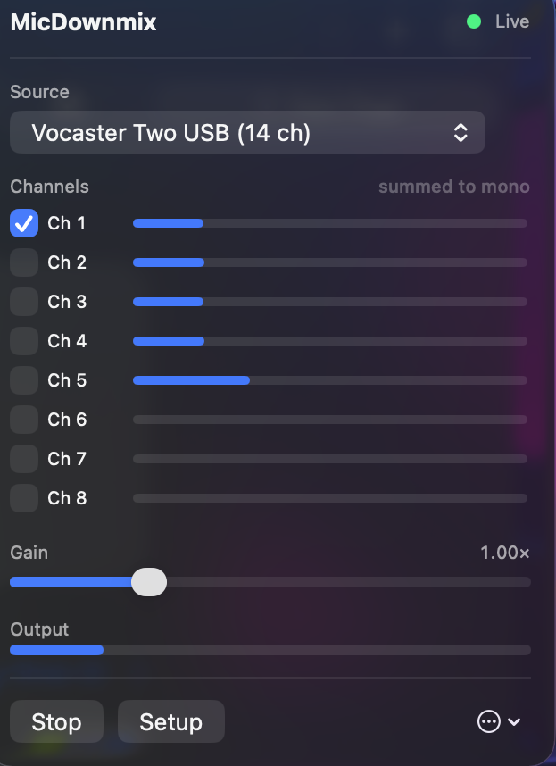
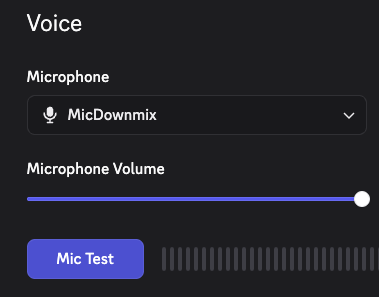

# MicDownmix

**Use an XLR mic on an audio interface with Discord on macOS.**

Discord [doesn't support audio interfaces on macOS](https://support.discord.com/hc/en-us/articles/360040580711-Audio-Interface-Issues-on-macOS).
Their own article says audio comes out choppy or cuts in and out, blames WebRTC, and tells you to
use a headset instead. Known since February 2020, still unfixed.

MicDownmix publishes a virtual microphone that's already mono 16-bit, so Discord never sees a
multi-channel interface.

<p align="center">
  
  &nbsp;&nbsp;
  
</p>

## Install

Download the `.pkg` from [Releases](../../releases) and open it. One password, then it launches
itself. Signed and notarized, so no security warnings.

Then click the menu bar icon, pick your interface, tick the channel your voice is on, and set
Discord's input to **MicDownmix**.

## Does this fix my problem?

Probably, if you're on a Mac and:

- Your interface mic is choppy, robotic, or cuts in and out in Discord
- It works in Zoom, OBS or QuickTime but not Discord
- It shows up in Discord but nobody can hear you

Audio routing utilities generally don't help here. They move audio between apps but don't change
what Discord does with a multi-channel input.

## How it works

Interfaces present their inputs as multi-channel Float32, often many more channels than you'd expect
from a two-input box. Collapsing that to mono is where things break: CoreAudio's `AudioConverter`
infers the channel map and gets it wrong at high channel counts.

Any interface works. MicDownmix enumerates whatever channels your device reports and lets you pick;
nothing is specific to a particular make or model.

So MicDownmix doesn't use it. It sums the channels you pick in a Float64 accumulator, hard limits,
and quantizes to 16-bit by hand. No CoreAudio conversion component anywhere in the path.

## Updating

MicDownmix checks GitHub for new releases once a day. **Nothing installs itself.** When an update
exists the menu bar icon shows a badge, and you choose whether to install it from the `...` menu.

Choosing to install downloads the package, verifies it is signed by the same developer as your copy
and accepted by Gatekeeper, then hands it to macOS's installer, which asks for your password.

You can also just download the latest release and run it. There is no need to uninstall first: the
installer stops the running copy, replaces the app and driver, and starts it again.

## Uninstalling

Use **Uninstall MicDownmix** from the menu bar icon's `...` menu. Dragging the app to the Trash is
not enough: the audio driver stays installed and keeps publishing a microphone that nothing drives.

If you already trashed the app:

```bash
curl -fsSL https://raw.githubusercontent.com/NickMariano/MicDownmix/main/Scripts/uninstall.sh | bash
```

## Limitations

- Runs at 16, 22.05, 32, 44.1, 48, 88.2 or 96 kHz. The virtual device is set to match your
  interface, so nothing resamples. Interfaces outside that list aren't supported.
- Mono out. Discord's mic path is mono anyway.
- The app must be running. It starts at login by default.
- macOS 15+, Apple Silicon and Intel.

## Building

Command Line Tools are enough; Xcode isn't used.

```bash
make        # driver and app
make test   # mixer tests
make pkg    # signed installer
```

## A note on AI

This was built with AI assistance (Claude). The design decisions, testing and verification were
reviewed by a human, and every claim in this README about behaviour was checked against a running
system rather than assumed.

## Licence

MIT.
